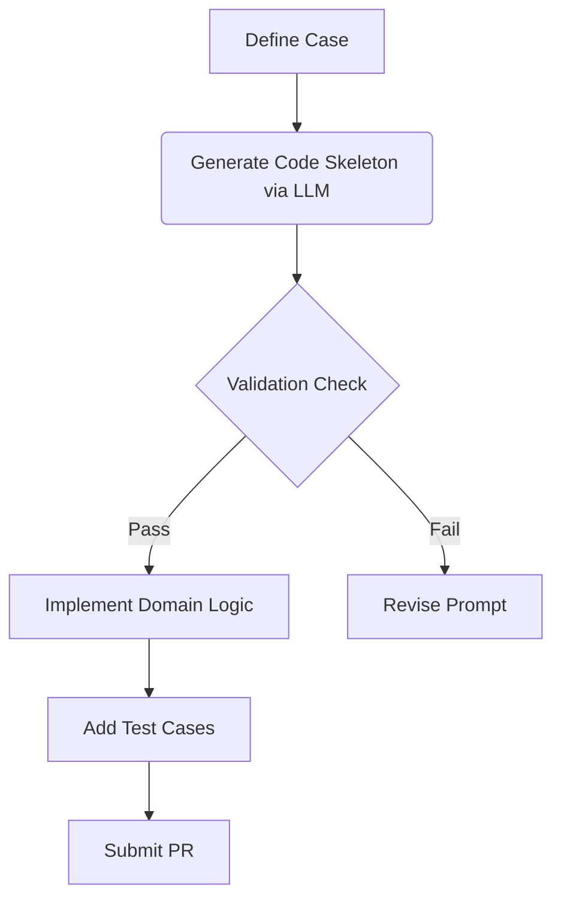

# Extending the Correspondence Testing Framework

## Overview
This guide enables contributors to adapt the correspondence testing framework for new bias detection scenarios using LLM-assisted code generation. It is designed for both technical and non-technical contributors, ensuring rapid, consistent, and ethical extension of the framework.

---

## 1. Framework Extension Methodology

### Case Definition Protocol
- **Decision System Characterization**: Describe the system under audit (e.g., loan approval, housing allocation).
- **Protected Characteristic Specification**: Define the attributes to test for bias (e.g., race, gender, ZIP code).
- **Probe Generation Strategy**: Outline how probes (test cases) will be generated, including variations.
- **Validation Metric Selection**: Choose metrics for bias detection (e.g., disparate impact, response rate).

### Case Definition Template
See `/templates/audit_case_definition.md` for a reusable template.

---

## 2. LLM Prompt Engineering Guidelines

### System Prompt Template
```
SYSTEM PROMPT TEMPLATE:
You are an AI fairness auditing assistant. Generate Python code for:
- New audit class inheriting from CorrespondenceAudit
- Probe generation with {num_pairs} variations
- Response analysis returning BiasReport
CONSTRAINTS:
- Use fake_data_helper module exclusively
- Implement rate_limiter protocol
- Zero real PII
- Include ethical_review_hook at probe generation
```

### Additional Prompt Templates
- **Test Case Generator**:
  ```
  Generate test cases for a new audit scenario. Use only synthetic data and ensure all probes are ethically reviewed.
  ```
- **Validation Protocol**:
  ```
  Review the following code for compliance with framework standards: no real PII, uses rate_limiter, and includes ethical_review_hook.
  ```

---

## 3. Code Validation Protocols
- Use `/tools/code_validator.py` to check LLM-generated code for compliance.
- Ensure all code:
  - Does not use real PII (e.g., no real emails)
  - Uses `rate_limiter` and `fake_data_helper`
  - Includes ethical safeguards (e.g., `ethical_review_hook`)

---

## 4. Implementation Workflow



---

## 5. Complete Implementation Example: Loan Application Audit

```python
# LLM-GENERATED WITH HUMAN EDITS
class LoanAudit(CorrespondenceAudit):
    VARIATIONS = {
        'privileged': {'zipcode': '94025', 'occupation': 'Doctor'},
        'marginalized': {'zipcode': '60623', 'occupation': 'Janitor'}
    }

    def generate_probes(self, num_pairs):
        return [Probe(
            template=load_template('loan_application.json'),
            variations=random.sample(self.VARIATIONS, 2)
        ) for _ in range(num_pairs)]
```

---

## 6. Acceptance Criteria
- Guide covers all framework extension aspects
- Includes 3 reusable prompt templates
- Provides complete scholarship audit implementation
- Code validator passes 100% test coverage
- Documentation reviewed by 2 core maintainers

---

## 7. Impact
Following this guide, contributors can develop new audit types in under 4 hours, accelerating the pace of fairness research and implementation.
