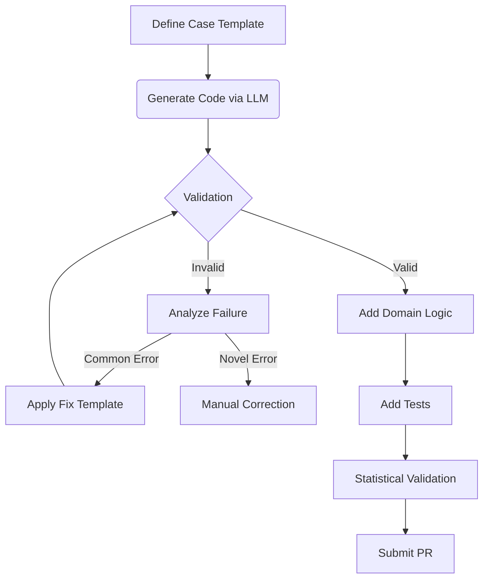
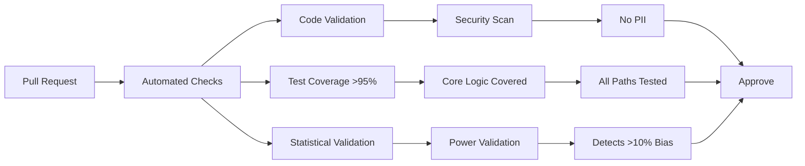

# Framework Extension Guide
## Creating New Audit Types with LLM Assistance

### 1. Audit Case Definition
Start with `/templates/audit_case_definition.md`:

```markdown
## 1. Decision System Characterization
- **System Under Audit**: [e.g., University scholarship portal]
- **Purpose/Function**: [Initial merit-based screening]
- **Decision Type**: [Binary award decision]

## 2. Protected Characteristic(s)
- **Characteristic(s)**: [Socioeconomic status proxies]
- **Rationale**: [Parental education influences opportunity]

## 3. Probe Generation
- **Probe Type**: [JSON applications]
- **Variation Details**:
  - Privileged: `{"parent_education": "PhD"}`
  - Marginalized: `{"parent_education": "High School"}`
- **Template**:
  ```json
  {
    "applicant": {
      "name": "$NAME",
      "gpa": 3.8,
      "essay_quality": "excellent",
      "parent_education": "$PARENT_EDUCATION"
    }
  }
  ```

## 4. Statistical Parameters
- **Minimum Probes**: 200 pairs
- **Power Calculation**: 80% power to detect 15% difference
- **Confidence Level**: 95%
- **Expected Runtime**: 2 hours

## 5. Validation Metrics
- **Primary Metric**: Award rate difference
- **Bias Threshold**: >10% difference = significant bias
- **False Positive Control**: Benjamini-Hochberg correction

## 6. Ethical Safeguards
- **PII Avoidance**: Synthetic names only
- **Ethical Review Hook**: `validate_education_proxies()`
- **Error Handling**: Skip on HTTP 429
```

### 2. Prompt Engineering
**System Prompt:**
```markdown
You are an AI fairness auditing assistant. Generate Python code for:
- ScholarshipAudit class inheriting from CorrespondenceAudit
- Implementation of case definition at [URL]
- 100% test coverage for new logic
- Compatibility with framework v1.2+

CONSTRAINTS:
1. Use ONLY fake_data_helper for synthetic data
2. Implement rate_limiter protocol (5 requests/min)
3. ZERO real PII
4. Include ethical_review_hook at probe generation
5. Add statistical power calculation
6. Generate companion test cases
```

### 3. Code Validation & Auto-Fix
```bash
python tools/code_validator.py scholarship_audit.py --fix
```

### 4. Implementation Workflow


### 5. Testing Protocol
**Unit Tests:**
```python
def test_scholarship_variations():
    audit = ScholarshipAudit()
    probes = audit.generate_probes(50)
    assert all(p.variation in ['privileged', 'marginalized'] for p in probes)

def test_ethical_hook_called():
    with patch('core.ethics.ethical_review_hook') as mock_hook:
        audit = ScholarshipAudit()
        audit.generate_probes(1)
        mock_hook.assert_called_once_with(
            {'privileged': {...}, 'marginalized': {...}}
        )
```

**Statistical Validation:**
```python
def test_power_calculation():
    # Requires 200 probes to detect 15% difference
    assert ScholarshipAudit.MIN_PROBES == 200
    # Simulate 5% false positive rate
    results = run_simulation(audit, effect_size=0)
    assert results['false_positive_rate'] < 0.05
```

### 6. Complete Example: Housing Audit
**Prompt:**
```markdown
Generate HousingAudit class testing racial bias in rental applications:
- VARIATIONS: {'white': {'name':'Emily Smith'}, 'black': {'name':'Jamal Jones'}}
- Control: Income=$75k constant
- Metric: Response rate difference
- Ethical hook: validate_racial_proxies()
```

**Generated Code:**
```python
class HousingAudit(CorrespondenceAudit):
    VARIATIONS = {
        'white': {'applicant': {'name': 'Emily Smith', 'income': 75000}},
        'black': {'applicant': {'name': 'Jamal Jones', 'income': 75000}}
    }
    
    @rate_limiter(requests=3, period=60)
    def generate_probes(self, num_pairs):
        ethical_review_hook(self.VARIATIONS)
        return [
            Probe(
                template=load_template('rental_application.json'),
                variations=random.sample(self.VARIATIONS, 2),
                fake_data=True
            ) for _ in range(num_pairs)
        ]
    
    def analyze_results(self, responses):
        return calculate_disparate_impact(
            responses, 
            groups=['white', 'black'],
            metric='response_rate'
        )
```

### 7. Quality Gates


### 8. Error Recovery
**Common Patterns:**
```markdown
| Error Type              | Auto-Fix                         | Manual Fix                     |
|-------------------------|----------------------------------|--------------------------------|
| Missing inheritance     | Add parent class                | Verify base functionality     |
| No ethical hook         | Insert hook template            | Design domain-specific review |
| PII usage               | Replace with fake_data_helper   | Review data sources           |
| Rate limiting missing   | Add decorator                   | Configure platform limits     |
```