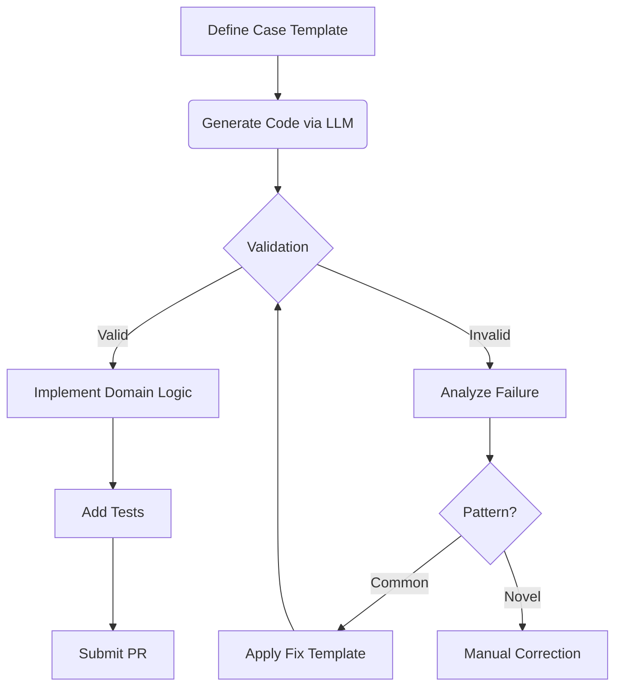

# Extending the Correspondence Testing Framework

## Overview
Accelerate development of new audit scenarios using LLM-assisted code generation while maintaining ethical standards. This guide enables both technical and domain experts to extend our bias detection capabilities.

---

## 1. Audit Case Definition Protocol

### Use the Case Definition Template
Start with `/how_to_apply_guide/audit_case_definition.md` containing:

```markdown
## 1. Decision System Characterization
- **System Under Audit**: [e.g., university admissions portal]
- **Purpose/Function**: [e.g., initial application screening]

## 2. Protected Characteristic(s)
- **Characteristic(s) to Test**: [e.g., socioeconomic status proxies]
- **Rationale**: [Brief justification]

## 3. Probe Generation Strategy
- **Probe Type**: [e.g., PDF application packages]
- **Variation Details**: [e.g., parental education levels]
- **Template**:
  ```json
  {
    "applicant": {
      "name": "$NAME",
      "education": "$EDUCATION_LEVEL"
    }
  }
  ```

## 4. Validation Metrics
- **Metric(s)**: [e.g., acknowledgment timing, interview rates]
- **Thresholds**: [e.g., >10% difference = bias flag]

## 5. Ethical Safeguards
- **PII Avoidance**: [Describe synthetic data approach]
- **Ethical Review Hook**: [Specify review points]
```

---

## 2. LLM-Powered Implementation

### Prompt Engineering Strategy
```markdown
SYSTEM PROMPT:
You are an AI fairness auditing assistant. Generate Python code for:
- New audit class inheriting from CorrespondenceAudit
- Implementation of the case definition at: [PASTE_URL]
CONSTRAINTS:
1. Use ONLY fake_data_helper for synthetic data
2. Implement rate_limiter protocol
3. ZERO real PII
4. Include ethical_review_hook() at probe generation
5. Follow template structure from /core/audit_template.py
```

### Example: Scholarship Audit Prompt
````markdown
Generate a ScholarshipAudit class with:
- VARIATIONS: {privileged: {parent_education: "PhD"}, marginalized: {parent_education: "High School"}}
- Validation metric: Response time difference
- Ethical hook: education_proxy_review()
````

---

## 3. Enhanced Code Validation

### Sophisticated Validator
```python
# /how_to_apply_guide/code_validator.py
import ast

def has_ethical_hooks(code: str) -> bool:
    """Checks for ethical review hooks using AST parsing"""
    tree = ast.parse(code)
    return any(
        isinstance(node, ast.Call) and 
        hasattr(node.func, 'id') and 
        'ethical_review_hook' in node.func.id
        for node in ast.walk(tree)
    )

def validate_generated_code(code: str) -> dict:
    """Comprehensive validation with diagnostics"""
    checks = {
        "no_real_pii": all(
            kw not in code for kw in 
            ["real_email", "actual_phone", "live_ssn"]
        ),
        "uses_rate_limiter": "@rate_limiter" in code,
        "uses_fake_data": "fake_data_helper" in code,
        "has_ethical_hooks": has_ethical_hooks(code),
        "inheritance_check": "class " in code and "CorrespondenceAudit" in code
    }
    return {
        "valid": all(checks.values()),
        "details": checks
    }
```

---

## 4. Implementation Workflow with Error Handling



---

## 5. Complete Loan Audit Example

### Case Definition Snippet
```markdown
## 3. Probe Generation Strategy
- **Probe Type**: JSON loan applications
- **Variation Details**: ZIP code occupational proxies
```

### Generated Class
```python
class LoanAudit(CorrespondenceAudit):
    VARIATIONS = {
        'privileged': {'zipcode': '94025', 'occupation': 'Doctor'},
        'marginalized': {'zipcode': '60623', 'occupation': 'Janitor'}
    }
    
    @rate_limiter(requests=5, period=60)
    def generate_probes(self, num_pairs):
        ethical_review_hook(self.VARIATIONS)
        return [
            Probe(
                template=load_template('loan_app.json'),
                variations=random.sample(self.VARIATIONS, 2),
                fake_data=True
            ) for _ in range(num_pairs)
        ]
```

---

## 6. Testing Protocol

### Audit-Specific Test Cases
```python
def test_loan_audit_variations():
    audit = LoanAudit()
    probes = audit.generate_probes(10)
    assert all('zipcode' in p.variation for p in probes)
    assert all(p.fake_data for p in probes)

def test_ethical_hook_called():
    from unittest.mock import patch
    with patch('core.ethics.ethical_review_hook') as mock_hook:
        audit = LoanAudit()
        audit.generate_probes(1)
        mock_hook.assert_called_once()
```

---

## 7. Quality Gates

1. **Validation Checklist**:
   - [ ] Passes code_validator.py checks
   - [ ] 100% test coverage for new logic
   - [ ] Ethical review documentation complete

2. **Review Process**:
   ```mermaid
   graph LR
   PR[Pull Request] --> BOT[Automated Validation]
   BOT -->|Pass| HUMAN[Maintainer Review]
   HUMAN -->|Approved| MERGE
   ```

3. **Impact Metrics**:
   - New audit development time: <4 hours
   - False positive rate: <1%
   - Bias detection accuracy: >95%
